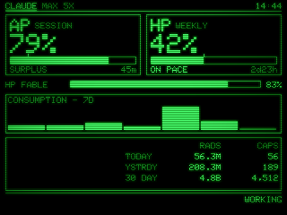
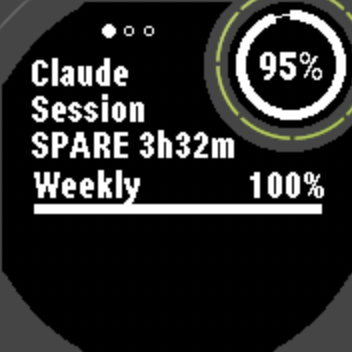

# ClaudeBoy

A Pip-Boy on the desk that shows how much of your Claude, Codex and Antigravity plans is
left, and whether you will run out before the window resets. A 2.8" ESP32 board draws it in
green phosphor; a Garmin Instinct 2X carries the same numbers on the wrist; a small Cloudflare
Worker feeds both.

<p>
  
  
</p>

Left: the board's STAT page as the host preview renders it -- the same image is a golden the
tests compare against. Right: the watch page in the Connect IQ simulator, with the worst
window's remaining budget drawn as a ring inside the Instinct's subscreen.

## The one question it answers

OpenUsage, a menu bar app, reports a set of windows per provider -- Session, Weekly, one per
model -- each with `used`, `limit`, `resetsAt` and a period. Those four fields are enough:

- **remaining** = `limit - used`, drawn as a bar that drains, never one that fills
- **elapsed** = how far through the window we are
- **pace** = used fraction / elapsed fraction. Above 1.02 is BURNOUT, below 0.90 is SURPLUS,
  between them ON PACE
- no verdict until 5% of the window has elapsed, because one percent of usage a minute into
  a five-hour window computes to a pace of three; a window with no reset time yet is READY

Each gauge carries a tick at where remaining *ought* to be if consumption were exactly on
budget. Bar past the tick means spare; bar short of it means trouble. That reads without
reading any numbers, which is what an ambient display is for. Vault Boy in the corner gives a
thumbs-up, finger guns, or slumps, keyed to the worst window.

## How the pieces fit

```
OpenUsage (localhost:6736)
      |  poll every 60s
      v
  Mac agent  ----POST /v1/push---->  Cloudflare Worker  --->  KV
  (launchd)                                |
                                           |  GET /v1/snapshot?client=...
                              +------------+------------+
                              |                         |
                         CYD board                Garmin widget
                        (WiFi, HTTPS)          (BLE -> phone -> HTTPS)
```

Four rules hold across all of it.

**The clients never learn that OpenUsage exists.** The agent converts to our schema. When
OpenUsage renames a field or gains a provider, no firmware changes and no watch app is rebuilt.

**The clients compute pace; the server sends the facts.** A precomputed `pace: 1.01` would
freeze between polls. Sending `used`, `limit`, `resetsAt` and `periodSec` lets each client
recompute every frame, so the tick creeps while you watch.

**Time comes from the response.** Every payload carries `serverTime`; each client keeps an
offset against its own millisecond counter. No NTP, no timezones, and when the network is gone
time is exactly as stale as the data it arrived with.

**Never blank on failure.** Keep the last values, dim them, show the age -- `STALE 24m`, then
`LOST 3h`.

Timestamps on the wire are epoch seconds, not milliseconds, because Monkey C's `Number` is
32-bit and the watch is the client that cannot afford a mistake. The watch payload stays under
4KB -- Garmin moves 400-800 bytes a second over BLE -- and a test enforces it.

## What is where

| path | what |
|---|---|
| `src/core/` | the display, in allocation-free C++17 shared by board and host: parser, pace maths, burn meter, fonts, the CRT filter, Vault Boy |
| `src/device/` | the ESP32 side: WiFi, HTTPS, the XPT2046 touch panel, `main.cpp` |
| `src/host/` | the same core on the Mac: PNG output, a terminal preview, the golden blesser |
| `test/` | Unity tests for the core, goldens included |
| `goldens/` | the reference renders the tests compare against |
| `server/` | the Worker, the Mac agent, the schema and its tests -- see [server/README.md](server/README.md) |
| `watch/` | the Connect IQ widget for the Instinct 2X Solar |
| `tools/` | generators: fonts from the Spleen BDFs, Vault Boy traced from artwork, the touch calibration solver |
| `fixtures/` | captured OpenUsage and API responses the tests and the preview run on |

## Building it

**Board and host** are one PlatformIO project with two environments compiling the same
`src/core/`:

    pio test -e native                                    # unit and golden tests
    pio run -e native && .pio/build/native/program --png  # render the fixtures to PNG
    .pio/build/native/program --tui                       # live terminal preview
    .pio/build/native/program --bless                     # regenerate goldens; read the diff first
    cp src/device/secrets.h.example src/device/secrets.h  # then fill it in
    pio run -e cyd -t upload && pio device monitor

The board has two firmwares from one tree. `-e cyd` fetches over WiFi and HTTPS
from the Worker; `-e cyd-ble` takes the same payload over BLE from the MacBook and
does not link the WiFi or TLS stacks at all. Measured on hardware: RAM 65,348 against the
WiFi build's 70,608, flash 659,513 against 982,265, and no 33,434-byte mbedtls session
allocation per handshake -- which is what used to drive the largest free block down to 34,804
and made TLS a tight fit.

    pio run -e cyd-ble -t upload      # the desk build, fed by the Mac agent
    cd server/mac && make             # the CoreBluetooth helper

The board is an ESP32-2432S028R, the "Cheap Yellow Display". Two settings in
`platformio.ini` look wrong and are not: the two-USB-port revision ships an ST7789, not the
ILI9341 the listing claims, and the CH340 bridge fails above 115200 baud.

### Installing the BLE path on the Mac

The helper runs as **its own launchd job**, never as a child of the agent. macOS attributes
Bluetooth permission to the responsible process, so a helper spawned by node is denied
silently -- `centralManagerDidUpdateState` never fires and no prompt appears at all. Run
directly by launchd it gets its own grant and prompts once.

    cd server/mac && make
    sed "s|/Users/CHANGEME|$HOME|" \
      server/launchd/com.dannonbaker.claudeboy-ble.plist.example \
      > ~/Library/LaunchAgents/com.dannonbaker.claudeboy-ble.plist
    launchctl bootstrap gui/$(id -u) ~/Library/LaunchAgents/com.dannonbaker.claudeboy-ble.plist

**Be at the keyboard for the first connection.** The board's characteristic demands an
encrypted link, so macOS raises a "ClaudeBoy" pairing alert -- and it times out in about
thirty seconds. Miss it and pairing fails with nothing obvious to show for it: the helper logs
`{"error":"Authentication is insufficient."}` for every frame, and the only direct evidence is
`SMP timeout ... status=4827` under `log show --predicate 'process == "bluetoothd"'`. Click
**Pair**. This is one-time -- the bond lives in the `nvs` partition, which `-t upload` never
touches. Only `erase_flash` clears it, and then you pair again.

Finally, point the always-on agent at the helper's socket, in the agent's own launchd plist:

    /usr/libexec/PlistBuddy -c "Add :EnvironmentVariables:CLAUDEBOY_BLE_SOCKET string \
      '$HOME/Library/Application Support/claudeboy/ble.sock'" \
      ~/Library/LaunchAgents/com.dannonbaker.claudeboy-agent.plist
    launchctl bootout gui/$(id -u)/com.dannonbaker.claudeboy-agent
    launchctl bootstrap gui/$(id -u) ~/Library/LaunchAgents/com.dannonbaker.claudeboy-agent.plist

Without that variable the agent still runs and still feeds the watch through the Worker. It
simply never writes to the board, which looks exactly like the board having died.

To check it is working, read `/tmp/claudeboy-ble.log`. A healthy transfer ends in
`{"wrote":N}`; a refused one ends in `{"failed":N}` with `{"error":...}` lines above it.

**Server**: `cd server && npm install && npm test`. Deploying, and the launchd agent, are in
its README.

**Watch**: needs the Connect IQ SDK and a JDK. Homebrew's `openjdk` is not on the default
PATH, and the SDK's scripts want `java` there.

    cd watch
    ./tools-gen-secrets.sh && ./tools-gen-properties.sh    # from ~/work/envs/claudeboy.env
    monkeyc -d instinct2x -f monkey.jungle -o bin/claudeboy.prg -y <developer key>
    monkeyc -d instinct2x -f monkey.jungle -o bin/claudeboy-release.prg -y <developer key> -r

To sideload, copy the release `.prg` into `GARMIN/Apps` on the watch's USB volume.
`sim.jungle` builds the same code as a watch-app, which the simulator opens straight onto the
full page (widgets start in the glance loop) and cycles providers on a timer -- useful because
the simulator drops scripted keystrokes unless the terminal has Accessibility rights.

## Secrets

Three files are git-ignored and made from examples: `src/device/secrets.h`,
`watch/source/Secrets.mc`, `watch/resources/settings/properties.xml`. The Worker's tokens live
in Wrangler secrets. The read token ships inside the firmware and the watch app, which is why
it is a different token from the push one.

## Design record

The reasoning -- why a Worker and not a tunnel, why the watch sets the payload budget, what the
Instinct's subscreen actually hides -- lives in the brain vault under
`plans/claudeboy-pipboy-ambient-display`, `plans/claudeboy-live-data` and `hardware/`.
`tools/assets/vaultboy/` holds Bethesda's artwork as tracing sources; strip it before this
repo is ever public.
